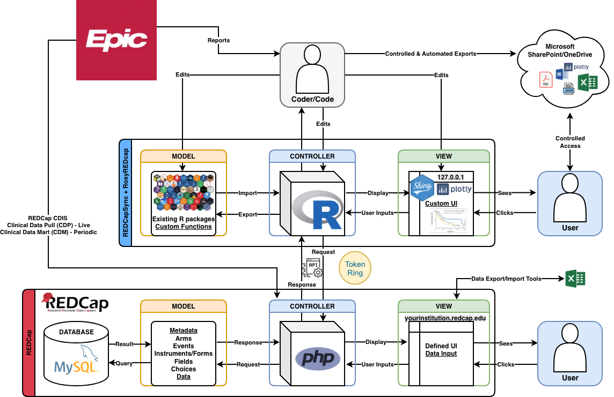
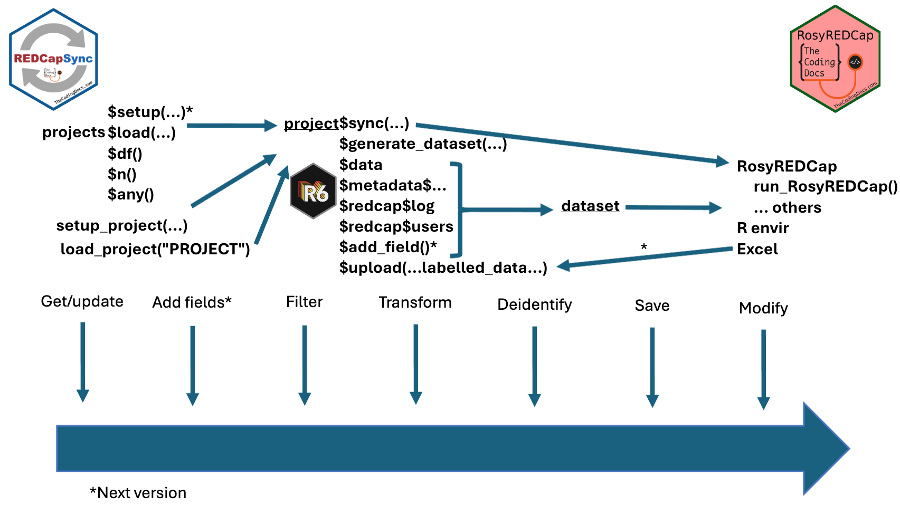
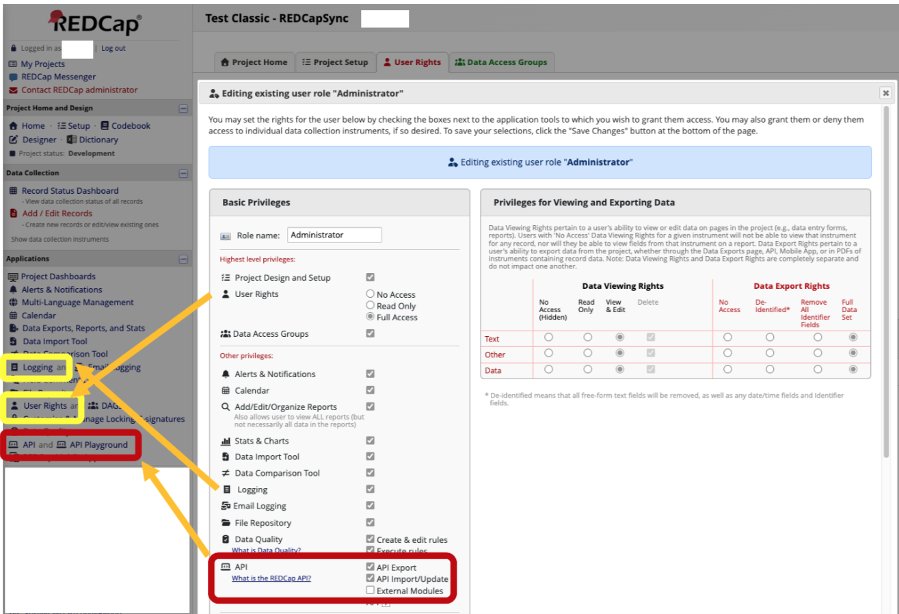

```{r setup, include=T,echo=F}
knitr::opts_chunk$set(echo = TRUE)
klippy::klippy()
withr::local_options(redcapsync.config.allow.test.names = FALSE)
tempdir_file <- withr::local_tempdir()
withr::local_envvar(R_USER_CACHE_DIR = tempdir_file)
library("REDCapSync") # load the library
library("RosyREDCap") # load the library
```

[`){ width=90px }](http://www.thecodingdocs.com) [`){ width=70px }](https://github.com/thecodingdocs/REDCapSync)[`){width=70px} ](https://github.com/thecodingdocs/RosyREDCap)

# Congratulations!

You just got recruited to do the data analysis for a large clinical trial. The data is all stored on REDCap for compliance and security reasons. You would call yourself an intermediate R user, but you really don't know much about REDCap... The previous data analyst quit. Once a week they were downloading all the data from the REDCap website and using a complicated R script to merge the data before manually labelling the data for use in SPSS. They were also overwhelmed with the constant requests for custom datasets and they were having to delete columns to avoid sharing sensitive data.

You know a better way because you heard about the REDCap API and the REDCapR and redcapAPI R packages. All you need is a token and you are good to go! Someone gave you code for merging repeating forms in a different REDCap but the column names are all specific to that old project. Your new boss also told you there are least 4 other REDCap projects you will be analyzing in the future! You start to panic because that's a lot of code and you wanted this job for the *analysis* experience, not the data-cleaning! You recently attended an R Medicine conference demo about the R packages REDCapSync and RosyREDCap that promised you they could make your life even easier! You can't wait to show your principal investigator the power of reproducible data pipelines!

# About Framework

R and REDCap are both widely used in clinical research, but integrating them efficiently remains a challenge. REDCapSync and RosyREDCap adopt a model-view-controller framework (see [thecodingdocs.com/articles/redcap](https://www.thecodingdocs.com/articles/redcap#h.xgr2561c7glz).)  [REDCapR](https://github.com/OuhscBbmc/REDCapR) and [redcapAPI](https://github.com/vubiostat/redcapAPI) are foundational REDCap R packages that are used behind-the-scenes to accomplish new exciting tasks. 

[](schema)

[REDCapSync](https://github.com/thecodingdocs/REDCapSync "github.com/thecodingdocs/REDCapSync") is a project-agnostic R package that retrieves and maintains complete REDCap datasets using an API-efficient, log-based approach—only updating what has changed. Each project is standardized into an R6 object for downstream analysis.

[RosyREDCap](https://github.com/thecodingdocs/REDCapSync "github.com/thecodingdocs/RosyREDCap") is a companion Shiny application that enables users to explore, deidentify, and visualize REDCap data without writing code. The R package also exports functions where the REDCapSync objects are used at inputs.

Together, these tools allow clinical teams to build reproducible data pipelines and easily distribute clean datasets—without needing deep knowledge of the REDCap API. The code below will walk you through how to use the REDCapSync and RosyREDCap R packages. 

[](framework)

# REDCap Access

This article will not cover how to get an API token from REDCap and setup the right privileges, However, at minimum, after having appropriate permission to use the data, ensure you have API token export privileges. Ideally, you should also have logging privileges to use the most efficient functionality of the package. At some institutions, API token have be requested and justified. To avoid having to do this to test the package functions, "TEST_" projects are built in. 

[](REDCap Access)

# 0. Install and Load

You can install the development version of REDCapSync and RosyREDCap by running the code below. Eventually package will be hosted on CRAN, so check back and install that version in the future! Keep in mind parameters or function names may evolve in the coming months, so if you are using stay up-to-date on the documentation if you plan to use.

```{r example1, eval=FALSE}
# install pak package if you don't have it
install.packages("pak") 

pak::pkg_install("thecodingdocs/REDCapSync") # installs REDCapSync from github
# install.packages("REDCapSync") # once on CRAN install like this

pak::pkg_install("thecodingdocs/RosyREDCap") # installs RosyREDCap from github
# install.packages("RosyREDCap") # once on CRAN install like this

library("REDCapSync") # load the library
library("RosyREDCap") # load the library

# see what projects exist with your current setup
REDCapSync::projects$print()
```

# 1. Setup Project(s)

Whether or not you currently have access to an existing REDCap project, the following steps will show you how to set up a test project with a real directory (Option 1A) or on real REDCap project (Option 1B).

## 1A. TEST Projects (No REDCap Required)

Test projects can be loaded by name ("TEST_CLASSIC" or "TEST_MULTIARM", etc) but you can also use setup_project to inform the object where to store files.

```{r, eval=FALSE}
your_directory <- getwd() # make sure you have an R project set up and that you are okay with files being stored here (be very careful with cloud drives and git repos!)

#test projects can be loaded but will not know where 
project <- load_project("TEST_CLASSIC")
project$dir_path # is NA

project <- setup_project(
  project_name = "TEST_CLASSIC",
  redcap_uri = "https://redcap.fake.edu/api/",
  dir_path = your_directory
)
project$dir_path # your chosen directory
```

## 1B. REAL Projects (requires API token)

```{r, eval=FALSE}
your_directory <- getwd() # make sure you have an R project set up and that you are okay with files being stored here (be very careful with cloud drives and git repos!)
help(setup_project)

project <- setup_project(
  project_name = "FIRST_PROJECT",
  redcap_uri = "https://redcap.fake.edu/api/", # see API playground
  dir_path = your_directory,
  sync_frequency = "daily", # default
  get_entire_log = TRUE # not default but helpful for datasets
)
```

# 2. Setup Token(s)

REDCap API tokens are equivalent to your username and password. They should never be shared with anyone. Ideally, they should never be directly written in an R script, especially if you plan on sharing it in the future. **Never commit a file containing your token on git or GitHub because this will forever be in the history.** If there is ever any doubt in your mind you should quickly regenerate your token on the REDCap website. If you are working on a *real* REDCap project it's good practice to regenerate your token periodically, such as once a week, just to be safe.

Precisely because tokens are sensitive, REDCapSync is designed to only reference the name of your token, such as "REDCAPSYNC_FIRST_PROJECT". If REDCapSync ever wants to use the token to make an API call to REDCap, it will check `Sys.getenv("REDCAPSYNC_FIRST_PROJECT")`. By default are token names start with "REDCAPSYNC_", followed by the `project_name` you chose in `setup_project()`. Below demonstrates how to set and check your tokens...

## 2A. Setting Your Token using User Environment Variables (preferred)

You may find want to reuse a token, and you may have several projects, so a convenient way to store the tokens in a separate location. One way to do this is your personal .Renviron file. Again, you should check always confirm the location of this file and make sure it's not a part of any cloud storage or git or GitHub. You can use `usethis::edit_r_environ()` to semi-permanently save your token. Each time you launch an R session this file will run and your token will be visible to you if specifically called with `Sys.getenv("REDCAPSYNC_FIRST_PROJECT")`.

1.  Open the .Renviron file with `usethis::edit_r_environ()`
2.  Add the token like this... `REDCAPSYNC_FIRST_PROJECT = "faKeTokeN"`
3.  Save the file and Close
4.  Restart R Session (Session tab or `.rs.restartR()`).
5.  Confirm with `Sys.getenv("REDCAPSYNC_FIRST_PROJECT")`

```{r, eval=FALSE}
#Install usethis if you don't have it.
#install.packages("usethis") 
usethis::edit_r_environ()
# Now save your token.... (without the comment symbol '#')
# REDCAPSYNC_FIRST_PROJECT = "faKeTokeN"
# Save the file and Close
# Restart R Session (session tab)
# .rs.restartR() # this will also restart R session for you.
Sys.getenv("REDCAPSYNC_FIRST_PROJECT") # now should contain your token
```

The only reference to your token that is ever made or saved in REDCapSync is with its name, such as "REDCAPSYNC_FIRST_PROJECT". The actual token is never stored with object.

## 2B. Setting Your Token using `keyring` package

By default REDCapSync will use keyring = NULL, which is your OS system default keyring and is typically unlocked by default while you are logged in. 

```{r, eval=FALSE}
# enter token in pop-up window
project$set_keyring_token() 
# internally the package checks ...
#1. Sys.getenv()
token <- Sys.getenv(project$.internal$token_name)
#2. followed by keyring
token <- keyring::key_get(service = config$keyring.service(),
                          username = project$project_name,
                          keyring = config$keyring())
# you could set with the following; not preferred because token in script
# if you do this set in securely in file that no one can ever see; never github!
keyring::key_set_with_value(service = config$keyring.service(),
                            username = project$project_name,
                            password = "VeryNOTsecureWayToSetYourTOKEN",
                            keyring = config$keyring())
```

## 2C. Setting Your Token for One Session

You can set manually with base R. Unless you specifically set the token `Sys.getenv("REDCAPSYNC_FIRST_PROJECT")` will be blank.

```{r, eval=FALSE}
# Set your token manually
# again having this in a script is not advised but possible
Sys.setenv(REDCAPSYNC_FIRST_PROJECT="a_FaKe_TOkEn_NEVER_in_a_script") 

# Get your token
Sys.getenv("REDCAPSYNC_FIRST_PROJECT")
#>[1] "a_FaKe_TOkEn"
```

Now the token is set for this R session only. If you restarted R, it would be blank again.

## Testing Token (optional)

If you are ever having any issues with your token, you can test your project object with `project$test_token()`.

```{r, eval=FALSE}
project$test_token()
```

# 3. Sync Project(s)

This is the core functionality of the REDCapSync package. You have defined the project(s), the folder(s) to save your work, and the token(s) that give you valid connection(s) to REDCap. Going forward, you may define custom datasets that export to excel, and other downstream analytic products that will refresh when you run sync() or project$sync(). In future versions, you may even be able to define additional fields outside of REDCap.

```{r, eval=FALSE}
# now sync everything (will save files to directory by default)
project$sync()

#if you have multiple projects this will sync them all!
sync()
```

Based on your defined sync frequency, sync will do the minimum necessary to update your project object and its related datasets.

# 4. Explore Project

The project object is an R6 list object. Think of it as a standardized list of data frames and functions (methods). See `help(REDCapSyncProject)`. The most important sections are `project$data` and `project$metadata`. They contain some of the raw information obtained from REDCap. However, more importantly, the object methods know how to use the sections in contacts to produce complex operations found in `project$add_dataset()`.

```{r, eval=FALSE}
forms <- project$metadata$forms # unchanged metadata
fields <- project$metadata$fields # unchanged metadata
choices <- project$metadata$choices # unchanged metadata

users <- project$redcap$users # unchanged users
log <- project$redcap$log # unchanged log

project$data |> list2env(globalenv()) # add raw data to envir

# the current public methods (more in development such add_field)
REDCapSyncProject$public_methods |> names() |> setdiff("initialize")
#  [1] "print"             "sync"              "add_dataset"      
#  [4] "load_dataset"      "remove_datasets"   "generate_dataset" 
#  [7] "save_datasets"     "save_dataset"      "save"             
# [10] "set_keyring_token" "test_token"        "url_launch"       
# [13] "url_record_launch" "upload"   

# unlike above fields, forms, choices are annotated
project$load_dataset("REDCapSync", envir = globalenv())
```

# 5. Define Datasets

Even though you can access data and more through the object as shown in step 4, the most powerful method for using the object is via `project$generate_dataset(...)` (for ad hoc exploration) and `project$add_dataset(...)` (for more permanently defining the dataset in a way that will be stored and refreshed during sync). The parameters in these functions allow for filtering, de-identification, date handling, labelling, and annotating records, users, and metadata with details from the log and data (such as last user to modify record). For the full use of these features it's recommended that you have logging privileges from user rights. See step 0.

## project$generate_dataset(...)

```{r, eval=FALSE}
your_directory <- getwd() # make sure you have an R project set up and that you are okay with files being stored here (be very careful with cloud drives and git repos!)
project <- setup_project(
  project_name = "TEST_CLASSIC",
  redcap_uri = "https://redcap.fake.edu/api/",
  dir_path = your_directory
)
project$metadata$fields$field_name # view field_names

dataset <- project$generate_dataset( 
  dataset_name = "add_age_at_diagnosis",
  envir = globalenv(), # puts in global R environment
  transformation_type = "default",
  merge_form_name = "merged",
  exclude_identifiers = FALSE,
  exclude_free_text = TRUE,
  date_handling = "random_shift_by_project",
  include_metadata = TRUE,
  include_records = TRUE,
  include_users = TRUE,
  include_log = TRUE,
  annotate_from_log = TRUE,
  include_comments = TRUE
)
#if you wanted you could modify and save custom (without add_dataset)
calc_age <- function(dob, age.day){
  (lubridate::interval(dob, age.day)/lubridate::duration(num = 1, 
        units = "years")) |> floor() |>  as.integer()
}
dataset$data$merged$age_at_diagnosis <- 
  dataset$data$merged$var_birth_date |> 
  calc_age(dataset$data$merged$diagnosis_start)

dataset$save()
# future dev will have this functionality parallel to add_dataset but as add_field and will be passed to all datasets and added to metadata (available for filter)
```

## project$add_dataset(...)

You may want to define many or dozens of refreshing custom datasets from one REDCap project for use in exports, reports, and more. When you use add data set, it's stored in the object until removed.

```{r, eval=FALSE}
your_directory <- getwd() # make sure you have an R project set up and that you are okay with files being stored here (be very careful with cloud drives and git repos!)
project <- setup_project(
  project_name = "TEST_CLASSIC",
  redcap_uri = "https://redcap.fake.edu/api/",
  dir_path = your_directory
)
project$metadata$fields$field_name # view field_names

project$add_dataset( 
  dataset_name = "stage_three_and_four",
  transformation_type = "default",
  merge_form_name = "merged",
  filter_field = "stage_at_diagnosis",
  filter_choices = c("III","IV"),
  exclude_identifiers = TRUE,
  exclude_free_text = FALSE,
  date_handling = "random_shift_by_project",
  include_metadata = TRUE,
  include_records = TRUE,
  include_users = TRUE,
  include_log = TRUE,
  annotate_from_log = TRUE,
  include_comments = TRUE
)
# project$remove_datasets("stage_three_and_four")

project$add_dataset( 
  dataset_name = "ecog_zero",
  transformation_type = "default",
  merge_form_name = "merged",
  filter_field = "ecog_at_diagnosis",
  filter_choices = "0",
  exclude_identifiers = TRUE,
  exclude_free_text = FALSE,
  date_handling = "random_shift_by_project",
  include_metadata = TRUE,
  include_records = TRUE,
  include_users = TRUE,
  include_log = TRUE,
  annotate_from_log = TRUE,
  include_comments = TRUE
)
# project$remove_datasets("ecog_zero")

project$.internal$datasets |> names() # now stored internally


project$save_datasets()
```

If you have a project with 10,000 records and a dataset that filters based on a certain variable with currently 100 records, REDCapSync will check the log, update only the records (n=50) that have changed, and if necessary refresh datasets they qualify for (from add_dataset(...)). 

# 6. RosyREDCap

For the demo finale... if REDCapSync is the "How" (controller), RosyREDCap is the "Why" (view)! RosyREDCap is an R golem shiny app that uses the foundation of REDCapSync to unleash standardized exploratory analysis on any REDCap project. The package is developmentally less-developed than REDCapSync but has the most "Wow" features and could not exist without the foundation laid by REDCapR, redcapAPI, and REDCapSync.

## Launch the app!!!

Everything below can be explored in the RosyREDCap locally on your PC. Setting `test_mode = TRUE` launches the app with only test projects.

```{r eval=FALSE}
run_RosyREDCap(test_mode = TRUE)
```

## Metadata Network

### Multiarm

```{r eval=TRUE, message=FALSE}
projects$load("TEST_MULTIARM") |> 
  REDCap_diagram(duplicate_forms = F, hierarchical = T)
```

### Classic

```{r eval=TRUE, message=FALSE}
projects$load("TEST_CLASSIC") |> REDCap_diagram(include_fields = T)
```

## Tables

```{r eval=TRUE, message=FALSE}
projects$load("TEST_CLASSIC")$load_dataset("REDCapSync")$data$merged |>
  make_table1(
    group = "var_branching",
    variables = c("stage_at_diagnosis", "ecog_at_diagnosis", "deceased")
  )
```

```{r eval=TRUE, message=FALSE}
load_project("TEST_CLASSIC")$
  generate_dataset(filter_field = "ecog_at_diagnosis", 
                   filter_choices = "0",
                   drop_blanks = TRUE
                   )$data$merged |>
  make_table1(group = "var_branching",
              variables = c("stage_at_diagnosis", "deceased"))
```

## Parcats/Sankey

```{r eval=TRUE, message=FALSE}
DF <- load_project("TEST_CLASSIC")$load_dataset("REDCapSync")$data$merged
DF$ecog_strat <- ifelse(DF$ecog_at_diagnosis %in% c("2", "3","4"),
                         "Poor",
                         "Good") |> 
  factor(levels = c("Poor", "Good"), ordered = T)
attr(DF$ecog_strat, "label") <- "Performance Status"
vars <-  c("ecog_strat", "stage_at_diagnosis", "deceased")
DF |> dplyr::select(vars) |> plotly_parcats()
```

## Survival

```{r eval=TRUE, message=FALSE}
DF <- load_project("TEST_CLASSIC")$load_dataset("REDCapSync")$data$merged
DF$ecog_strat <- ifelse(DF$ecog_at_diagnosis %in% c("2", "3","4"),
                         "Poor",
                         "Good") |> 
  factor(levels = c("Poor", "Good"), ordered = T)
attr(DF$ecog_strat, "label") <- "Performance Status"
DF$deceased <- as.integer(DF$deceased == "True")
DF |> 
  make_survival(start_col = "diagnosis_start",
                end_col = "last_contact",
                strat_col = "ecog_strat",
                status_col = "deceased",
                units = "years",
                xlim = c(0, 4))
```

# 7. Advanced/Dev

Another unique feature of REDCapSync is the ability to upload labelled data. Currently, you can use R to modify data and then upload back to REDCap. For classic REDCap projects, without events or repeating instruments, uploading data is straight forward. For more complex data, you must follow the same rules as the REDCap data import tool (using `redcap_event_name`, `redcap_repeat_instrument`, and `redcap_repeat_instance`). RosyREDCap is developing ways to modify this data without having to understand these details. 

```{r eval=TRUE, message=FALSE}
projects$load("TEST_MULTIARM")$.internal |> listviewer::jsonedit()
```

## Uploads

```{r eval=FALSE, message=FALSE}
project <- load_project("TEST_CLASSIC")$sync()

upload_this <- data.frame(record_id = as.character(51:100),
                          var_branching = sample(c("Yes", "No"), 
                                                 size = 50, 
                                                 replace = TRUE),
                          ecog_at_diagnosis = "0")

project$upload(upload_this)
# future dev will have comparisons/checks and calculated fields (from R).
```

For more advanced features/feedback consider reaching out to the developer [TheCodingDocs\@gmail.com](mailto:TheCodingDocs@gmail.com).

# Links
-   Feedback/Contact form [link here](https://forms.gle/Y31KNzfpo7SrDZTQ6)
-   The REDCapSync package is at [github.com/thecodingdocs/REDCapSync](https://github.com/thecodingdocs/REDCapSync "REDCapSync R package"). See instructions above.
-   The RosyREDCap package is at [github.com/thecodingdocs/RosyREDCap](https://github.com/thecodingdocs/RosyREDCap "RosyREDCap R package").
-   For more R coding visit [TheCodingDocs.com](https://www.thecodingdocs.com/ "TheCodingDocs.com")
-   For correspondence/feedback/issues, please email [TheCodingDocs\@gmail.com](mailto:TheCodingDocs@gmail.com)!
-   Follow us on Twitter/X [x.com/TheCodingDocs](https://x.com/TheCodingDocs/ "TheCodingDocs Twitter")
-   Follow me on Twitter/X [x.com/BRoseMDMPH](https://x.com/BRoseMDMPH/ "BRoseMDMPH Twitter")

[`){ width=90px }](http://www.thecodingdocs.com) [`){ width=70px }](https://github.com/thecodingdocs/REDCapSync)[`){width=70px} ](https://github.com/thecodingdocs/RosyREDCap)


